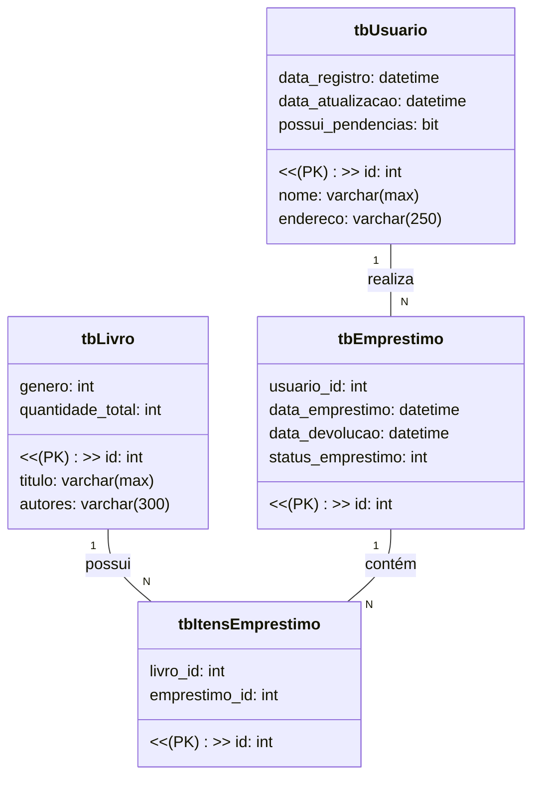

# Gestão de bibliotecas

O sistema proposto é de uma gestão de biblioteca no qual é possível cadastrar livros, usuários 
e empréstimos de livros para esses usuários. 
Segue um diagrama de classes proposto:

## Tecnologias utilizadas

* Linguagem C#
* ASP.Net Core 6
* Entity Framework
* Banco de dados SQL Server

## Principais gegras de negócio iniciais

* Usuário só pode ser apagado caso não tenha nenhum empréstimo em seu nome
* Só pode excluir empréstimos que estiverem com status “Devolvido”
* O livro só pode ser excluído se não estiver em nenhum empréstimo

## Pre requisitos

* Dar um git clone deste repositório
* Tem que ter o Visual Studio ou VS Code instalado e ter suporte ao .Net core 6
* Ter o SQL Server instalado
* Management Studio para rodar queries (opcional, eu acho)

## Instruções (Rodar local)

* Criar o banco "GESTAO_BIBLIOTECA" executando CREATE DATABASE GESTAO_BIBLIOTECA
* Executar o script "1-Script_criacao_banco_ef_core.sql" (está aqui no repositório) - vai criar as tabelas com as migrations
  OBS: É possível criar pelo entity framework também
* Executar o script "2-Faz_inserts_nas_tabelas.sql"
  
* No arquivo da API, ir no arquivo 'appsettings.Development.json' e ajustar a string de conexão na variável
  "SqlServerConnection": "Server=<se_servidor>;Database=GESTAO_BIBLIOTECA;User=<seu_usuario>;Password=<sua_senha>;Trusted_Connection=True;TrustServerCertificate=true;"
* Executar no Visual Studio

## Este projeto ao final deve conter

* API REST em ASP.Net Core
* Script do banco de dados
* Frontend em Angular (Ainda não está pronto - 10/05/2024)

## Mapeamento de melhorias

* Criação de conteiner docker para a solução
* Disponibiliar aplicação em produção (vantagem de não ter que configurar, apenas rodar)
* Code Review (melhorias no geral)

## Documentação local

### Swagger
* http://localhost:5000/swagger/index.html

## Considerações
Espero que gostem do que desenvolvi. É um projeto relativamente pequeno mas 
fiz o melhor que pude e me dediquei bastante. 
Algumas implementações do frontend ainda estão em curso

